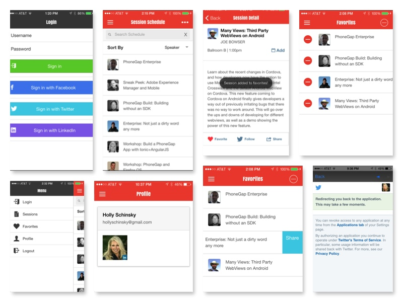
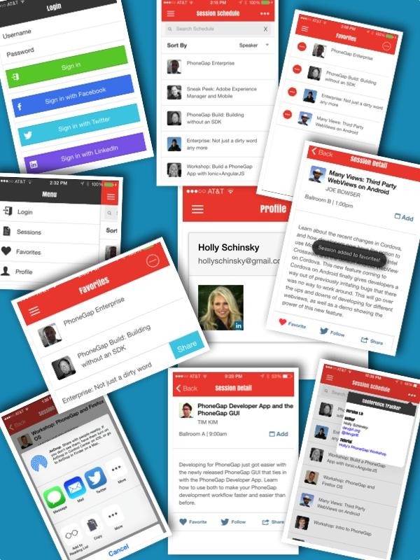

Conference Tracker - An Advanced Hybrid App Tutorial
===========================

### Follow [the in-depth tutorial here](http://hollyschinsky.github.io/ConferenceTracker/)

## What you will build
In this tutorial you will learn everything you need to take a hybrid application from scratch to app store lesson by lesson.
This tutorial builds upon the previous [Beginning PhoneGap Workshop](hollyschinsky.github.io/phonegap-workshop/) where we built a basic 
Conference application using no particular MVC framework. In this advanced version we will build an app using a more opinionated approach 
with Cordova/Ionic/AngularJS and a Node/ExpressJS REST API backend data service.

Throughout this tutorial you will be advised on how to handle different challenges and learn many useful tips. This app implements the 
following features that you will learn to add in the following lessons: 

## App Features 
1. **Side Menu** - Side menu navigation with icons
2. **Custom Status Bar** - Set the font and icons to white to match the title bar text
3. **Custom Keyboard Accessory Bar** - keep accessory bar for drop-down options on sort
4. **Login with Facebook, LinkedIn or Twitter** - in addition to a custom login option using OAuth
5. **Profile** - display the user's profile based on the social media logged in with
6. **Facebook integration** - using a non-plugin approach
7. **Add to native calendar** - easily add a session to your native calendar with all session details
8. **Favorites Management** - add to favorites / remove from favorites by tapping heart again or via the Favorites menu option list manager
9. **Swipe to share from list**
10. **Share with native sharing system on device**
11. **Uses native notifications/dialogs**
12. **Toast-style alerts**
13. **Modal login panel upon open**
14. **Popover 'About' screen**
15. **Sort options** - sort sessions by different criteria
16. **Filter/Search** - Search all data with a search term
17. **Handling offline**
17. **Numerous AngularJS directives and patterns used including:**
    -routing
    -repeat
    -ngSwitch
    -ngShow
    -ngHide
    -ngClass
    -ngClick    
 
## Plugins
The following plugins will be added along the way to help provide the above features:

1. Social Share Plugin 
2. Calendar Plugin
3. Toast Notification Plugin
4. Status Bar Plugin
5. Keyboard Plugin
6. Device Plugin
7. InAppBrowser (for social media OAuth)
8. Console Plugin
9. NetworkInformation/Connection Plugin

## Other Skills You Will Learn
1. Setting icons and splash screens
2. Debugging with Safari, Weinre and more
3. Testing with the PhoneGap Developer App
4. App Store Submission Tips
5. Using Google font libraries
6. How to setup OAuth.io with your social media accounts

>The plugin details will be covered along the way. Take a look at the [Official Cordova Plugin Registry](http://plugins.cordova.io) here to explore further as well. 

 

Setting up the Ionic App
-------------------------
1. Ensure you have [Ionic](http://ionicframework.com/getting-started/) installed (and are using latest version)

2. Create a new Ionic project

        ionic start ConferenceTracker

3. Replace the **/www** folder with the **/www** folder from this project.

4. Add the InAppBrowser plugin (needed for Facebook OAuth on device)

        cordova plugins add org.apache.cordova.inappbrowser

5. Add the dialogs plugin (for native style alert dialogs)

        cordova plugin add org.apache.cordova.dialogs

6. Add desired platforms (when ready to test on device)

        ionic platform add ios

7. Run on desired platform

        ionic run ios

**IMPORTANT NOTE:** Facebook integration for Login with Facebook and Profile menu option currently only works when running with the browser via [http://localhost:5000/#/app/sessions](http://localhost:5000/#/app/sessions) after setting up REST services below. It does not yet work via Ionic run/serve. Working on it.

Setting up the REST Services
----------------------------
** Copy the **/server** folder from this repo into the Ionic project root folder created above

1. Install server dependencies. Navigate into **/server** folder from the command line and type:

        npm install

2. Start the node server

        node server

3. Go to [http://localhost:5000/sessions](http://localhost:5000/sessions) to test your node service in your browser and make sure you see session data returned in JSON format.

Test the app in the browser with: [http://localhost:5000/#/app/sessions](http://localhost:5000/#/app/sessions)

** Login with your Facebook credentials from the Login screen if you want to see your profile info in the Profile menu option.