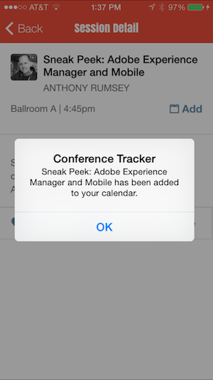
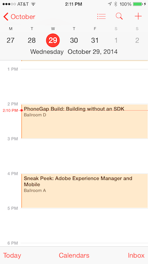
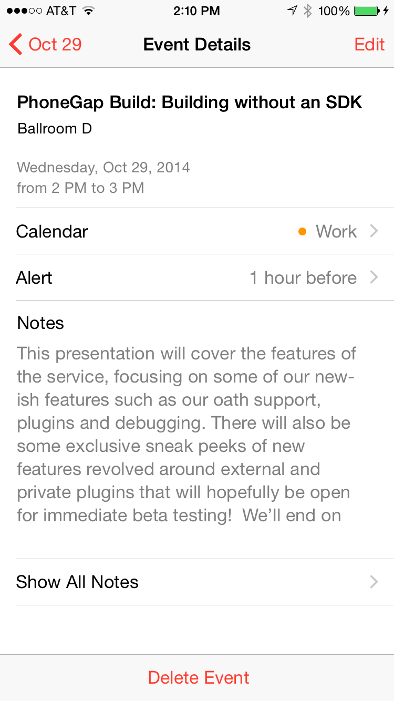

In this section, we add the ability to add a session to the native calendar on the device.
### Steps

1. Add this calendar plugin to your project:

    ```
    $ cordova plugin add https://github.com/EddyVerbruggen/Calendar-PhoneGap-Plugin.git
    
    ```

2. In **index.html**, add the following tab to the tab-bar *session-tpl* template:

    ```
    <div class="addBtn tab-item">
        <span class="icon icon-plus"></span>
        <span class="tab-label">Add</span>
    </div>
    ```

3. In the **initialize()** function of *SessionView*, register an event listener for the click event of the *addBtn* tab.

    ```
    this.$el.on('click', '.addBtn', this.addToCalendar);
    ```

    >Make sure you add this line as the last line of the **initialize()** function (after this.$el is assigned).

4. While in *SessionView*, define the *addToCalendar* event handler as follows:

    ```
    this.addToCalendar = function() {
        if (window.plugins.calendar) {
            var hour = session.time.substring(0,session.time.indexOf(':'));
            if (session.time.indexOf("pm")>-1)
                hour = parseInt(hour)+12;
    
            var startDate = new Date(2014,9,23,hour,00,00); //set to PG Day workshop date
            var endDate = new Date();
            endDate.setTime(startDate.getTime() + 3600000);//one hour
    
            var calSuccess = function (message) {
                alert(session.title + " has been added to your calendar.");
            };
            var calError = function (message) {
                alert("Error: " + message);
            };
            window.plugins.calendar.createEvent(session.title, session.room, session.description, startDate, endDate,
                function(){alert(session.title + " has been added to your calendar.");}, function (error) {
                    console.log("Calendar fail " + error);
                });
        }
        else console.log("Calendar plugin not found");
    }
    ```

5. Test the Application

When you click the add or plus tab, you should see a notification popup and a new entry added to your native calendar for today's date 
at the session time such as below:

    
 
>On the simulator use shift+cmd+h to get to the home screen to find the calendar to verify.
 
<div class="row" style="margin-top:40px;">
<div class="col-sm-12">
<a href="hardware-acceleration.html" class="btn btn-default"><i class="glyphicon glyphicon-chevron-left"></i> 
Previous</a>
<a href="share.html" class="btn btn-default pull-right">Next <i class="glyphicon 
glyphicon-chevron-right"></i></a>
</div>
</div>


