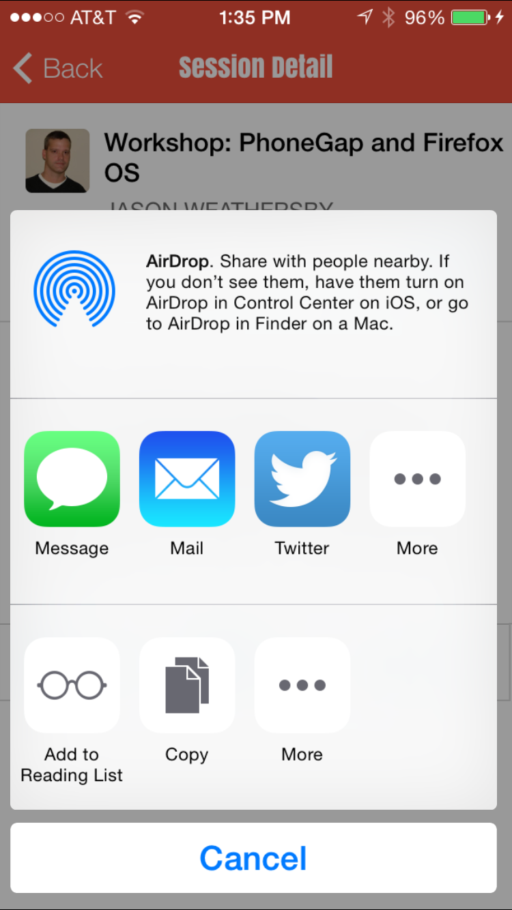

In this section, we add the ability to share the session details through the device's native sharing options. 
### Steps

1. Add the social sharing plugin to your project:

    ```
    $ cordova plugin add https://github.com/EddyVerbruggen/SocialSharing-PhoneGap-Plugin/
    
    ```

1. In **SessionView.html**, wire the share tab to the *shareNative* function in the controllers.js via ng-click:

    ```
   <a class="tab-item" ng-click="shareNative()">
        <i class="icon ion-share"></i> Share
    </a>
    ```

1. Open **controllers.js** and define the *shareNative* function to the sessionsCtrl as follows:

    ```
    $scope.shareNative = function() {
            if (window.plugins && window.plugins.socialsharing) {
                window.plugins.socialsharing.share("I'll be attending the session: " + $scope.session.title + ".",
                    'PhoneGap Day 2014', null, "http://pgday.phonegap.com/us2014",
                    function() {
                        console.log("Success")
                    },
                    function (error) {
                        console.log("Share fail " + error)
                    });
            }
            else console.log("Share plugin not available");
    }
    ```

1. Test the Application



>The options shown here will depend on your particular devices' native sharing options. 

<div class="row" style="margin-top:40px;">
<div class="col-sm-12">
<a href="add-to-calendar.html" class="btn btn-default"><i class="glyphicon glyphicon-chevron-left"></i> 
Previous</a>
<a href="statusbar.html" class="btn btn-default pull-right">Next <i class="glyphicon 
glyphicon-chevron-right"></i></a>


</div>
</div>


